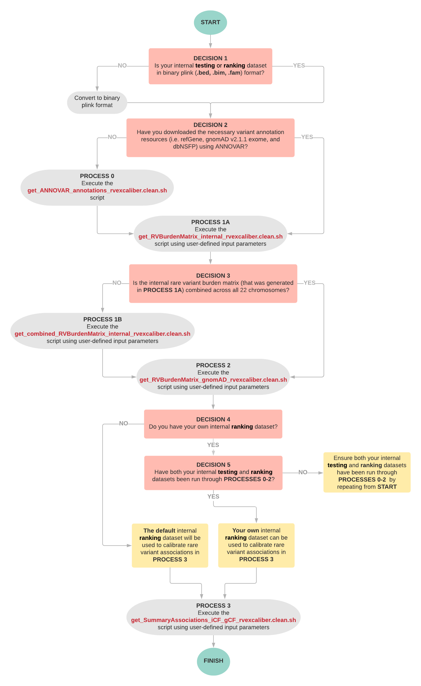

# RV-EXCALIBER

## Table of Contents

 - [Welcome](#welcome)
 - [Definitions and workflow](#definitions-and-workflow)
 - [Download](#download)
 - [Directory architecture](#directory-architecture)
 - [Quality control of genetic data](#quality-control-of-genetic-data)
 - [Input data required for
   RV-EXCALIBER](#input-data-required-for-rv-excaliber)
 - [Essential dependencies](#essential-dependencies)
 - [Retained dependency-generated
   files](#retained-dependency-generated-files)
 - [Definitions of script inputs](#definitions-of-script-inputs)
 - [Preparing the RV-EXCALIBER
   scripts](#preparing-the-rv-excaliber-scripts)
 - [Running the RV-EXCALIBER scripts](#running-the-rv-excaliber-scripts)
 - [Expected outputs from the RV-EXCALIBER
   scripts](#expected-outputs-from-the-rv-excaliber-scripts)
 - [A note on result interpretation](#a-note-on-result-interpretation)
 - [Contact information](#contact-information)
 - [Citation](#citation)

## Welcome

Welcome to the official GitHub repository for **R**are **V**ariant **EX**ome **CALIB**ration using **E**xternal **R**epositories (RV-EXCALIBER), a comprehensive framework for conducting rare variant association testing by leveraging large exome sequencing repositories as controls.

### **Overarching aim:**

The summary-level allele frequencies derived from publicly available exome sequencing databases, such as the genome Aggregation Database (gnomAD), represent those expected to be found the general population and can therefore be leveraged as a control distribution. However, using such databases in their raw form will lead to biased genetic associations.

### **High-level methodological overview:**

RV-EXCALIBER works by instituting **1)** a correction that accounts for the increased variance due to the presence of rare variants in linkage disequilibrium, **2)** an individual-level correction factor (iCF) that accounts for global variations in population substructure and sequencing technology, and **3)** a gene-level correction factor (gCF) that accounts for granular deviations in allele burden bias amongst gene sets.

## Definitions and workflow

**gnomAD**: an external whole-exome sequencing repository containing _summary-level_ allele frequency information that will be used as a control dataset in RV-EXCALIBER

**internal testing dataset**: a whole-exome sequencing dataset containing _individual-level_ genotypes that will be used in conjunction with the summary-level allele frequencies from gnomAD to conduct a gene-based rare variant association test using RV-EXCALIBER

**internal ranking dataset**: a whole-exome sequencing dataset containing _individual-level_ genotypes that will be used to calibrate association signals from the gene-based rare variant association test that was conducted using your testing dataset and gnomAD (see definition of testing dataset above)



## Download

RV-EXCALIBER can be downloaded locally by executing a ```git clone``` command as follows (please ensure you have [git](https://git-scm.com/book/en/v2/Getting-Started-Installing-Git) installed prior to issuing the following commands):

```sh
# Enter a directory in which RV-EXCALIBER is to be downloaded

cd genetics

# Initialize a local git repository

git init

# Execute the git clone command

git clone https://github.com/GMELab/RV-EXCALIBER.git
```


## Directory architecture

```sh
# Enter the cloned RV-EXCALIBER directory

cd /genetics/RV-EXCALIBER

# View directory architecture

ls -l | awk '{ print $9 }'
gnomAD_211_exomes_hg19
gnomAD_211_exomes_hg19_coverage
gnomAD_211_exomes_hg19_filter
default_ranking_dataset
scripts
```
### ```/gnomAD_211_exomes_hg19```
Contains re-formatted per-variant annotation files (per autosomal chromosome) containing refGene, gnomAD 211, and dbNSFP annotations.

### ```/gnomAD_211_exomes_hg19_coverage```
Contains a ```.bed``` file containing "high coverage coding" autosomal regions from gnomAD. A "high coverage coding" region is defined as an individual exon where a mean read depth of 20X was achieved for at least 90% of individuals in gnomAD. This ```.bed``` file will be intersected against variant sites in your internal testing and/or ranking dataset and in gnomAD if the ```coverage``` input variable is set to **hcc** in the ```get_RVBurdenMatrix_internal_rvexcaliber.clean.sh``` and the ```get_RVBurdenMatrix_gnomAD_rvexcaliber.clean.sh``` scripts. Please see a more detailed explanation of input variables in the [Definitions of script inputs](#defintions-of-script-inputs) section.

### ```/gnomAD_211_exomes_hg19_filter```
Contains a ```.txt``` file with the FILTER status of all gnomAD autosomal variant sites. The per-variant gnomAD FILTER status is used to eliminate variants that are **mutually observed** in both  your internal case dataset and gnomAD which do not have a FILTER status of PASS in gnomAD.

### ```/default_ranking_dataset```
Contains a ```.txt``` file with the summary associations obtained by using RV-EXCALIBER on n = 6,082 healthy controls from the Myocardial Infarction Genetics (MIGen) consortium. This will act as your **internal ranking dataset** if the ```internal_ranking_dataset``` input variable is set to **NA** in the ```get_SummaryAssociations_iCF_gCF_rvexcaliber.clean.sh``` script. Please see a more detailed explanation of input variables in the [Definitions of script inputs](#definitions-of-script-inputs) section of the README.

### ```/scripts```
Contains the RV-EXCALIBER shell and Rscripts.

## Quality control of genetic data
The quality-control of genetic data is essential towards achieving robust downstream results. A thorough description of the _variant-level_ and _sample-level_ quality control procedures that we implemented on our exome sequencing datasets can be found in the **Supplementary Appendix (Section 4-6) from our bioRxiv preprint**:
https://www.biorxiv.org/content/10.1101/2020.02.03.931519v1

## Input data required for RV-EXCALIBER

The current release of RV-EXCALIBER has been designed to conduct rare variant association tests using **whole-exome sequencing** (WES) data. The only input required are the binary plink files (i.e. ```.bed```, ```.bim```, ```.fam```) from your WES dataset(s) of choice.
If your WES data is stored in Variant Call File (VCF) format, it can easily be converted to plink binary format using the ```--make-bed``` command within plink v1.9 as shown below:
```sh
plink=/genetics/tools/plink_v1.9/plink
plink --noweb \
      --vcf /genetics/inData/MIGen_BioImage_ExS_QC.bg.vcf.gz \
      --vcf-half-call missing \
      --keep-allele-order \
      --make-bed \
      --out /genetics/inData/MIGen_BioImage_ExS_QC
```
If your VCF is correctly formatted, it will be converted to plink binary format:
```sh
cd /genetics/inData
ls -l | awk '{ print $9 }'
MIGen_BioImage_ExS_QC.bg.vcf.gz
MIGen_BioImage_ExS_QC.bg.vcf.gz.tbi
MIGen_BioImage_ExS_QC.bed
MIGen_BioImage_ExS_QC.bim
MIGen_BioImage_ExS_QC.fam
MIGen_BioImage_ExS_QC.log
MIGen_BioImage_ExS_QC.nosex
```

## Essential dependencies

RV-EXCALIBER makes use of 3 dependencies to prepare the rare variant burden matrices that are used as input for rare variant association testing. Please ensure to have these dependencies downloaded to directories with appropriate read/write privileges.
| Dependency | Purpose in RV-EXCALIBER &emsp;&emsp;&emsp;&emsp;&emsp;&emsp;&emsp;&emsp;&emsp;&emsp;&emsp;&emsp;&emsp;&emsp;&emsp;&emsp; | Tested version &emsp;&emsp;&emsp;&emsp;&emsp;&emsp;&emsp;&emsp; | Download page | Reference&emsp;&emsp;&emsp;&emsp;&emsp;&emsp;&emsp;&emsp;&emsp;&emsp;&emsp;&emsp;&emsp;&emsp;&emsp;&emsp; |
| ------ | ------ | ------ | ------ | ------ |
| **ANNOVAR** | Region and filter-based annotation | version release: 2019-10-24 | https://annovar.openbioinformatics.org/en/latest/user-guide/download/ | Wang K, Li M, Hakonarson H. ANNOVAR: functional annotation of genetic variants from high-throughput sequencing data. Nucleic Acids Res. 2010;38(16):e164. doi:10.1093/nar/gkq603
| **plink**| Storage and filtering of genetic sequencing data, calculating rare variant burden scores | version 1.9 | https://www.cog-genomics.org/plink/1.9/ | Chang CC, Chow CC, Tellier LC, Vattikuti S, Purcell SM, Lee JJ. Second-generation PLINK: rising to the challenge of larger and richer datasets. Gigascience. 2015;4(1):7. doi:10.1186/s13742-015-0047-8 |
| **bedtools2** | Variant and region-based intersection with gnomAD PASS sites and gnomAD high coverage coding sites | version 2.25.0 | https://github.com/arq5x/bedtools2/releases | Quinlan AR and Hall IM, 2010. BEDTools: a flexible suite of utilities for comparing genomic features. Bioinformatics. 26, 6, pp. 841–842 |
| **The R Project for Statistical Computing**** | Statistical analysis | version 3.6.0 "Planting of a Tree" | https://www.r-project.org/ | R Core Team (2019). R: A language and environment for statistical computing. R Foundation for Statistical Computing, Vienna, Austria. URL https://www.R-project.org/ |

### **Essential R packages to be installed:
The more updated version of the following R packages are still compatible. Please select the appropriate CRAN mirror during the install.  
| R package | Tested version | Package install | Reference |
| ------ | ------ | ------ |------ |
| ggplot2 | version 3.3.2 | ```install.packages("ggplot2")``` |  H. Wickham. ggplot2: Elegant Graphics for Data Analysis. Springer-Verlag New York, 2016. |
| dplyr | version 1.0.2 | ```install.packages("dplyr")``` | Hadley Wickham, Romain François, Lionel Henry and Kirill Müller (2020). dplyr: A Grammar of Data Manipulation. R package version 1.0.2. https://CRAN.R-project.org/package=dplyr |
| data.table | version 1.13.0 | ```install.packages("data.table")``` |   Matt Dowle and Arun Srinivasan (2020). data.table: Extension of `data.frame`. R package version 1.13.0. https://CRAN.R-project.org/package=data.table |

## Retained dependency-generated files
| File name | Dependency | File contents |
| ------ | ------ | ------ |
| ```.annovar.output``` | ANNOVAR | Standard output (stdout) from the ```table_annovar.pl``` ANNOVAR script |
|```.hg19_multianno.txt.gz```| ANNOVAR | Per-variant annotations from refGene, gnomAD, and dbNSFP databases |

## Definitions of script inputs

RV-EXCALIBER requires users to execute **4 shell scripts** which function to **0)** annotate variants in the internal testing and/or ranking dataset with the refGene, gnomAD 211, and dbNSFP databases,  **1)** generate a rare variant burden matrix for your internal testing and/or ranking dataset, **2)** generate a rare variant burden matrix for gnomAD, and **3)** generate summary gene-based rare variant association statistics

This section functions to clearly define the necessary inputs for each RV-EXCALIBER shell script. For examples on how to run the following scripts, please refer to the [Running the RV-EXCALIBER scripts](#running-the-rv-excaliber-scripts) section

### 0. ```get_ANNOVAR_annotations.clean.sh```
**Purpose:** Download the refGene, gnomAD 211, and dbNSFP databases to ANNOVAR's ```/humandb``` directory, if not done so already

### 1A. ```get_RVBurdenMatrix_internal_rvexcaliber.clean.sh```
**Purpose:** Generate a rare variant burden matrix for the internal testing and/or ranking datasets
**Number of required input variables:** 9

| Variable name | Variable category &emsp;&emsp;&emsp;&emsp;&emsp;&emsp;&emsp;&emsp; | Variable description &emsp;&emsp;&emsp;&emsp;&emsp;&emsp;&emsp;&emsp;&emsp;&emsp;&emsp;&emsp;&emsp;&emsp;&emsp;&emsp;&emsp;&emsp;&emsp;&emsp;&emsp;&emsp;&emsp;&emsp;&emsp;&emsp;&emsp;&emsp;&emsp;&emsp;&emsp;&emsp;&emsp;&emsp;&emsp;&emsp;&emsp;&emsp;&emsp;&emsp; | Required input &emsp;&emsp;&emsp;&emsp;&emsp;&emsp;&emsp;&emsp;&emsp;&emsp;&emsp;&emsp;&emsp;&emsp;&emsp;&emsp;&emsp;&emsp;&emsp;&emsp; |
| ------ | ------ | ------ | ------ |
| ```indir``` | Directory & naming |full path to the directory containing the input binary plink files (```.bed```, ```.fam```, ```.bim```)| character string
| ```outdir``` |Directory & naming|full path to the directory to where all output files will be directed|character string
| ```internal_dataset``` |Directory & naming|name of the binary plink files for your internal **testing** or **ranking** dataset (i.e. identical to what is specified with the plink ```--bfile``` or ```--out``` commands)| character string
| ```gnomAD_MAF_threshold``` |Filter |upper-limit minor allele frequency threshold from **gnomAD** used to filter variants| comma separated numeric value for multiple thresholds (e.g. **0.001**,**0.01**) or single numeric value for a single threshold (e.g. **0.001**) |
| ```internal_MAF_threshold``` | Filter |upper-limit minor allele frequency threshold from your internal **testing** or **ranking** dataset used to filter variants| single numeric value |
| ```MCAP_threshold``` |Filter |lower-limit threshold M-CAP score used to select nonsynonymous SNVs| comma separated numeric value for multiple thresholds (e.g. **0.009**,**0.025**) or single numeric value for a single threshold (e.g. **0.009**)|
| ```eth``` |Filter|ethnic group of the comparator gnomAD frequencies| character string, which must be one of: **"nfe"** for Non-Finnish European, **"afr"** for African, **"sas"** for South Asian, **"eas"** for East Asian, or **"amr"** for Latino; a weighted comparator gnomAD allele frequency can also be generated by inputting underscore separated ```eth``` variables  followed by the percentage weight it contributes to the final weighted comparator gnomAD allele frequency (e.g. **"nfe90_afr10"** will result in a weighted comparator gnomAD allele frequency that is 90% and 10% similar to the **nfe** and **afr** gnomAD ethnic groups, respectively), where the percentage weights must add to 100 |
| ```coverage```|Filter| conduct site-based intersection of your internal testing or ranking dataset with high-coverage coding (hcc) regions in gnomAD| character string, which must be on of : **"hcc"** for high-coverage coding, or **"rcc"** for regular-coverage coding |
| ```job_interval``` |Miscellaneous|number of genes that are applied in parallel to generate a final rare variant burden matrix| Numeric integer|

### 1B. ```get_combined_RVBurdenMatrix_internal_rvexcaliber.clean.sh``` (if necessary)
**Purpose:** If your internal testing and/or ranking rare variant burden matrices generated in the ```get_RVBurdenMatrix_internal_rvexcaliber.clean.sh``` script  were split by chromosome, this script combines the resulting split rare variant burden matrices into a **single matrix**
**Number of required input variables:** 7

| Variable name | Variable category &emsp;&emsp;&emsp;&emsp;&emsp;&emsp;&emsp;&emsp; | Variable description &emsp;&emsp;&emsp;&emsp;&emsp;&emsp;&emsp;&emsp;&emsp;&emsp;&emsp;&emsp;&emsp;&emsp;&emsp;&emsp;&emsp;&emsp;&emsp;&emsp;&emsp;&emsp;&emsp;&emsp;&emsp;&emsp;&emsp;&emsp;&emsp;&emsp;&emsp;&emsp;&emsp;&emsp;&emsp;&emsp;&emsp;&emsp;&emsp;&emsp; | Required input &emsp;&emsp;&emsp;&emsp;&emsp;&emsp;&emsp;&emsp;&emsp;&emsp;&emsp;&emsp;&emsp;&emsp;&emsp;&emsp;&emsp;&emsp;&emsp;&emsp; |
| ------ | ------ | ------ | ------ |
| ```outdir``` | Directory & naming | full path to the directory to where all output files will be directed |character string |
|```combined_internal_dataset```|Directory & naming|desired name of your combined internal **testing** or **ranking** dataset |character string|
| ```gnomAD_MAF_threshold``` |Filter |the upper-limit minor allele frequency threshold from **gnomAD** that was used to filter variants in the ```get_RVBurdenMatrix_internal_rvexcaliber.clean.sh``` and  ```get_RVBurdenMatrix_gnomAD_rvexcaliber.clean.sh``` scripts | comma separated numeric value for multiple thresholds (e.g. **0.001**,**0.01**) or single numeric value for a single threshold (e.g. **0.001**) |
| ```MCAP_threshold``` |Filter |the lower-limit threshold M-CAP score used to filter nonsynonymous SNVs in the ```get_RVBurdenMatrix_internal_rvexcaliber.clean.sh``` and  ```get_RVBurdenMatrix_gnomAD_rvexcaliber.clean.sh``` scripts | comma separated numeric value for multiple thresholds (e.g. **0.009**,**0.025**) or single numeric value for a single threshold (e.g. **0.009**)|
| ```eth``` |Filter|identify which ethnic group(s) of the comparator gnomAD frequencies you selected in the ```get_RVBurdenMatrix_internal_rvexcaliber.clean.sh``` script | character string, which must be one of: **"nfe"** for Non-Finnish European, **"afr"** for African, **"sas"** for South Asian, **"eas"** for East Asian, or **"amr"** for Latino; if you selected multiple ```eth``` variables to generate a weighted comparator gnomAD allele frequency, please separate the variables and their percentage weights with with an underscore (e.g. **"nfe90_afr10"**) || ```coverage```|Filter|identify whether you conduced site-based intersection of internal testing or ranking dataset with gnoMAD high coverage coding regions in the ```get_RVBurdenMatrix_internal_rvexcaliber.clean.sh``` and  ```get_RVBurdenMatrix_gnomAD_rvexcaliber.clean.sh``` scripts | character string, which must be on of : **"hcc"** for high-coverage coding, or **"rcc"** for regular-coverage coding |
|```internal_RVBurdenMatrix_filelist```|file list|a concatenated list of the full paths to the per-chromosome rare variant burden matrices generated in the ```get_RVBurdenMatrix_internal_rvexcaliber.clean.sh``` script |character string|

### 2. ```get_RVBurdenMatrix_gnomAD_rvexcaliber.clean.sh```
**Purpose:** Generate a rare variant burden matrix for gnomAD that corresponds to you internal testing and/or ranking dataset
**Number of required input variables:** 6

| Variable name | Variable category &emsp;&emsp;&emsp;&emsp;&emsp;&emsp;&emsp;&emsp; | Variable description &emsp;&emsp;&emsp;&emsp;&emsp;&emsp;&emsp;&emsp;&emsp;&emsp;&emsp;&emsp;&emsp;&emsp;&emsp;&emsp;&emsp;&emsp;&emsp;&emsp;&emsp;&emsp;&emsp;&emsp;&emsp;&emsp;&emsp;&emsp;&emsp;&emsp;&emsp;&emsp;&emsp;&emsp;&emsp;&emsp;&emsp;&emsp;&emsp;&emsp; | Required input &emsp;&emsp;&emsp;&emsp;&emsp;&emsp;&emsp;&emsp;&emsp;&emsp;&emsp;&emsp;&emsp;&emsp;&emsp;&emsp;&emsp;&emsp;&emsp;&emsp; |
| ------ | ------ | ------ | ------ |
| ```outdir``` |Directory & naming|full path to the directory to where all output files will be directed|character string
| ```internal_dataset``` |Directory & naming|name of a corresponding internal **testing** or **ranking** dataset (i.e. identical to what was specified for the ```internal_dataset``` variable in the ```get_RVBurdenMatrix_internal_rvexcaliber.clean.sh``` script) or the name of the ```combined_internal_dataset``` variable in the ```get_combined_RVBurdenMatrix_internal_rvexcaliber.clean.sh``` script if you had to combine your internal testing or ranking datasets across chromosomes | character string |
| ```gnomAD_MAF_threshold``` |Filter |upper-limit minor allele frequency threshold from **gnomAD** used to filter variants| comma separated numeric value for multiple thresholds (e.g. **0.001**,**0.01**) or single numeric value for a single threshold (e.g. **0.001**) |
| ```MCAP_threshold``` |Filter |lower-limit threshold M-CAP score used to select nonsynonymous SNVs| comma separated numeric value for multiple thresholds (e.g. **0.009**,**0.025**) or single numeric value for a single threshold (e.g. **0.009**)|
| ```eth``` |Filter|ethnic group of the comparator gnomAD frequencies| character string, which must be one of: **"nfe"** for Non-Finnish European, **"afr"** for African, **"sas"** for South Asian, **"eas"** for East Asian, or **"amr"** for Latino; a weighted comparator gnomAD allele frequency can also be generated by inputting underscore separated ```eth``` variables  followed by the percentage weight it contributes to the final weighted comparator gnomAD allele frequency (e.g. **"nfe90_afr10"** will result in a weighted comparator gnomAD allele frequency that is 90% and 10% similar to the **nfe** and **afr** gnomAD ethnic groups, respectively), where the percentage weights must add to 100 |
| ```coverage```|Filter| conduct site-based intersection of your internal testing or ranking dataset with high-coverage coding (hcc) regions in gnomAD| character string, which must be on of : **"hcc"** for high-coverage coding, or **"rcc"** for regular-covarage coding |

### 3. ```get_SummaryAssociations_iCF_gCF_rvexcaliber.clean.sh```
**Purpose:** Generate iCF and gCF-adjusted gene-based rare variant association statistics
**Number of required input variables:** 8

| Variable name | Variable category &emsp;&emsp;&emsp;&emsp;&emsp;&emsp;&emsp;&emsp; | Variable description &emsp;&emsp;&emsp;&emsp;&emsp;&emsp;&emsp;&emsp;&emsp;&emsp;&emsp;&emsp;&emsp;&emsp;&emsp;&emsp;&emsp;&emsp;&emsp;&emsp;&emsp;&emsp;&emsp;&emsp;&emsp;&emsp;&emsp;&emsp;&emsp;&emsp;&emsp;&emsp;&emsp;&emsp;&emsp;&emsp;&emsp;&emsp;&emsp;&emsp; | Required input &emsp;&emsp;&emsp;&emsp;&emsp;&emsp;&emsp;&emsp;&emsp;&emsp;&emsp;&emsp;&emsp;&emsp;&emsp;&emsp;&emsp;&emsp;&emsp;&emsp; |
| ------ | ------ | ------ | ------ |
| ```outdir``` | Directory & naming | full path to the directory to where all output files will be directed |character string |
|```internal_testing_dataset```|Directory & naming|name of your  internal **testing** dataset (i.e. identical to what was specified for the ```internal_dataset``` variable in the ```get_RVBurdenMatrix_internal_rvexcaliber.clean.sh``` script) or the name of the ```combined_internal_dataset``` variable in the ```get_combined_RVBurdenMatrix_internal_rvexcaliber.clean.sh``` script if you had to combine your internal testing dataset across chromosomes |character string|
|```internal_ranking_dataset```|Directory & naming|name of your  internal **ranking** dataset (i.e. identical to what was specified for the ```internal_dataset``` variable in the ```get_RVBurdenMatrix_internal_rvexcaliber.clean.sh``` script) or the name of the ```combined_internal_dataset``` variable in the ```get_combined_RVBurdenMatrix_internal_rvexcaliber.clean.sh``` script if you had to combine your internal ranking dataset across chromosomes |character string, or **NA** if you do not have a dedicated internal ranking dataset |
| ```gnomAD_MAF_threshold``` |Filter |the upper-limit minor allele frequency threshold from **gnomAD** that was used to filter variants in the ```get_RVBurdenMatrix_internal_rvexcaliber.clean.sh``` and  ```get_RVBurdenMatrix_gnomAD_rvexcaliber.clean.sh``` scripts | comma separated numeric value for multiple thresholds (e.g. **0.001**,**0.01**) or single numeric value for a single threshold (e.g. **0.001**) |
| ```MCAP_threshold``` |Filter |the lower-limit threshold M-CAP score used to filter nonsynonymous SNVs in the ```get_RVBurdenMatrix_internal_rvexcaliber.clean.sh``` and  ```get_RVBurdenMatrix_gnomAD_rvexcaliber.clean.sh``` scripts | comma separated numeric value for multiple thresholds (e.g. **0.009**,**0.025**) or single numeric value for a single threshold (e.g. **0.009**)|
| ```eth``` |Filter|identify which ethnic group(s) of the comparator gnomAD frequencies you selected in the ```get_RVBurdenMatrix_internal_rvexcaliber.clean.sh``` script | character string, which must be one of: **"nfe"** for Non-Finnish European, **"afr"** for African, **"sas"** for South Asian, **"eas"** for East Asian, or **"amr"** for Latino; if you selected multiple ```eth``` variables to generate a weighted comparator gnomAD allele frequency, please separate the variables and their percentage weights with with an underscore (e.g. **"nfe90_afr10"**) |
| ```coverage```|Filter|identify whether you conduced site-based intersection of internal testing or ranking dataset with gnoMAD high coverage coding regions in the ```get_RVBurdenMatrix_internal_rvexcaliber.clean.sh``` and  ```get_RVBurdenMatrix_gnomAD_rvexcaliber.clean.sh``` scripts | character string, which must be on of : **"hcc"** for high-coverage coding, or **"rcc"** for regular-coverage coding |
| ```adjust_type``` | Filter | type of adjustment to conduct on the gnomAD allele counts | character input, which must be one of: **"noadjust"** to leave the gnomAD counts unadjusted, or **"fulladjust"** to initiate full iCF and gCF adjustment to gnomAD allele counts (**recommended**)   |

## Preparing the RV-EXCALIBER scripts

Each of the 4 shell scripts that are to be executed by the user will require either the **path to the unpacked rvexcaliber directory** or the **paths to the dependencies** to be defined.
**Variable names to these paths will be present in the header information of each script**

### 0.  ```get_ANNOVAR_annotations.clean.sh```
**1** path to be defined by the user

| Path to be defined by user &emsp;&emsp;&emsp;&emsp;&emsp;&emsp;&emsp;&emsp;&emsp;&emsp;&emsp;&emsp;&emsp;&emsp;&emsp;&emsp; | Corresponding variable name in script header | Example path |
| ------ | ------ | ------ |
| Full path to the ANNOVAR perl scripts | ```annovar``` | ```/genetics/tools/annovar```

**Important:** the above script executes ANNOVAR's ```annotate_variation.pl``` script to download the necessary annotation databases used by RV-EXCALIBER (refGene, gnomAD 211, and dbNSFP)

### 1A. ```get_RVBurdenMatrix_internal_rvexcaliber.clean.sh```
**4** paths to be defined by the user

| Path to be defined by user &emsp;&emsp;&emsp;&emsp;&emsp;&emsp;&emsp;&emsp;&emsp;&emsp;&emsp;&emsp;&emsp;&emsp;&emsp;&emsp; | Corresponding variable name in script header | Example path |
| ------ | ------ | ------ |
| Full path to the cloned ```/RV-EXCALIBER``` directory (see [Download](#download)) | ```path_to_rvexcaliber``` | ```/genetics/RV-EXCALIBER``` |
| Full path to the ANNOVAR perl scripts | ```annovar``` | ```/genetics/tools/annovar```
| Full path to the ```plink``` command-line executable in plink version 1.9 | ```plink```  | ```/genetics/tools/plink_v1.9/plink``` |
| Full path to the ```intersectBed``` command-line executable in bedtools | ```bedtools``` | ```/genetics/tools/bedtools2/bin/intersectBed``` |

### 1B. ```get_combined_RVBurdenMatrix_internal_rvexcaliber.clean.sh``` (if necessary)
**1** path to be defined by the user

| Path to be defined by user &emsp;&emsp;&emsp;&emsp;&emsp;&emsp;&emsp;&emsp;&emsp;&emsp;&emsp;&emsp;&emsp;&emsp;&emsp;&emsp;| Corresponding variable name in script header | Example path |
| ------ | ------ | ------ |
| Full path to the cloned ```/RV-EXCALIBER``` directory (see [Download](#download)) | ```path_to_rvexcaliber``` | ```/genetics/RV-EXCALIBER``` |

### 2. ```get_RVBurdenMatrix_gnomAD_rvexcaliber.clean.sh```
**1** path to be defined by the user
| Path to be defined by user &emsp;&emsp;&emsp;&emsp;&emsp;&emsp;&emsp;&emsp;&emsp;&emsp;&emsp;&emsp;&emsp;&emsp;&emsp;&emsp;| Corresponding variable name in script header | Example path |
| ------ | ------ | ------ |
| Full path to the cloned ```/RV-EXCALIBER``` directory (see [Download](#download))  | ```path_to_rvexcaliber``` | ```/genetics/RV-EXCALIBER``` |

### 3. ```get_SummaryAssociations_iCF_gCF_rvexcaliber.clean.sh```
**1** path to be defined by the user
| Path to be defined by user &emsp;&emsp;&emsp;&emsp;&emsp;&emsp;&emsp;&emsp;&emsp;&emsp;&emsp;&emsp;&emsp;&emsp;&emsp;&emsp; | Corresponding variable name in script header | Example path |
| ------ | ------ | ------ |
| Full path to the cloned ```/RV-EXCALIBER``` directory (see [Download](#download))  | ```path_to_rvexcaliber``` | ```/genetics/RV-EXCALIBER``` |


## Running the RV-EXCALIBER scripts

Before running the RV-EXCALIBER scripts, please ensure each script has been prepared correctly by referring the [Preparing the RV-EXCALIBER scripts](#preparing-the-rv-excaliber-scripts) section

### 0.  ```get_ANNOVAR_annotations.clean.sh```

```sh
# Define path to shell scripts
rvexcaliber_shell_scripts=/genetics/RV-EXCALIBER/scripts/shell

cd ${rvexcaliber_shell_scripts}

bash get_ANNOVAR_annotations.clean.sh
```

### 1A. ```get_RVBurdenMatrix_internal_rvexcaliber.clean.sh```
**9** required inputs (see [Definitions of script inputs](#definitions-of-script-inputs) for their definitions)

#### Condition A: Your internal testing or ranking dataset _is not_ split by chromosome  (or split in any other fashion)

```sh
# Define path to shell scripts

rvexcaliber_shell_scripts=/genetics/RV-EXCALIBER/scripts/shell

# If your internal testing or ranking dataset ** IS NOT ** split by chromosome  (or split in any other fashion):

cd ${rvexcaliber_shell_scripts}

bash get_RVBurdenMatrix_internal_rvexcaliber.clean.sh /genetics/inData /genetics/outData MIGen_BioImage_ExS_QC 0.001,0.005 0.01 0.009,0.025 nfe Y 10
```

#### Condition B: Your internal testing or ranking dataset _is_ split by chromosome  (or split in any other fashion)

```sh
# Define path to shell scripts
rvexcaliber_shell_scripts=/genetics/RV-EXCALIBER/scripts/shell

# If your internal testing or ranking dataset ** IS ** split by chromosome (or split in some other fashion):

cd ${rvexcaliber_shell_scripts}

for chr in {1..22}; do

    bash get_RVBurdenMatrix_internal_rvexcaliber.clean.sh /genetics/inData /genetics/outData ${chr}_MIGen_BioImage_ExS_QC 0.001,0.005 0.01 0.009,0.025 nfe hcc 10

done
```

### 1B.  `get_combined_RVBurdenMatrix_internal_rvexcaliber.clean.sh` (if necessary)

**7**  required inputs (see  [Definitions of script inputs](#definitions-of-script-inputs) for their definitions)

**Important:** If your internal testing or ranking datasets **is** split by chromosome, or split in any other way,  (**Condition B** above), you must combine the split rare variant burden matrices (that were generated in the  ```get_RVBurdenMatrix_internal_rvexcaliber.clean.sh``` script) into a **single matrix**. This can be done with the ```get_combined_internal_matrix_rvexcaliber.clean.sh``` script as follows:

```sh
# Step 1: Generate concatenated list of the full paths to the rare variant burden matrix for each chromosome that was generated in the 'get_RVBurdenMatrix_internal_rvexcaliber.clean.sh' script

for chr in {1..22}; do

  for gnomAD_MAF_threshold in 0.001 0.005; do

    for MCAP_threshold in 0.009 0.025; do

      for eth in nfe; do

        for coverage in hcc; do

          echo /genetics/outData/${i}_MIGen_BioImage_ExS_QC_RVBurdenMatrix_${gnomAD_MAF_threshold}_${MCAP_threshold}_${eth}_${coverage}.txt.gz >> /genetics/outData/MIGen_BioImage_ExS_QC_RVBurdenMatrix_filelist.txt

       done

      done

    done

  done

done


# Step 2: Execute the get_combined_internal_matrix_rvexcaliber.clean.sh script as follows:

bash get_combined_internal_matrix_rvexcaliber.clean.sh /genetics/outData MIGen_BioImage_ExS_QC 0.001,0.005 0.009,0.025 nfe hcc /genetics/outData/MIGen_BioImage_ExS_QC_RVBurdenMatrix_filelist.txt
```

### 2. ```get_RVBurdenMatrix_gnomAD_rvexcaliber.clean.sh```
**6** required inputs (see [Definitions of script inputs](#definition-of-script-inputs) for their definitions)

```sh
# Define path to shell scripts:

rvexcaliber_shell_scripts=/genetics/RV-EXCALIBER/scripts/shell

# If your internal testing or ranking ** IS NOT ** split by chromosome:

cd ${rvexcaliber_shell_scripts}

bash get_RVBurdenMatrix_gnomAD_rvexcaliber.clean.sh /genetics/outData MIGen_BioImage_ExS_QC 0.001,0.005 0.009,0.025 nfe hcc
```

### 3. ```get_SummaryAssociations_iCF_gCF_rvexcaliber.clean.sh```
**8** required inputs (see the [Definitions of script inputs](#definitions-of-script-inputs) section for their definitions)

#### Condition A: You _do not_ have a dedicated internal ranking dataset

```sh
# Define path to shell scripts:

rvexcaliber_shell_scripts=/genetics/RV-EXCALIBER/scripts/shell

# If you ** DO NOT** have a dedicated ranking dataset, set the 'internal_ranking_dataset' variable to NA

cd ${rvexcaliber_shell_scripts}

bash get_RVBurdenMatrix_gnomAD_rvexcaliber.clean.sh /genetics/outData MIGen_BioImage_ExS_QC NA 0.001,0.005 0.009,0.025 nfe hcc fulladjust
```

#### Condition B: You _do_ have a dedicated internal ranking dataset

```sh
# Define path to shell scripts:

rvexcaliber_shell_scripts=/genetics/RV-EXCALIBER/scripts/shell

# If you ** DO ** have a dedicated ranking dataset, set the 'internal_ranking_dataset' variable to the name of your internal ranking dataset, which you defined in the 'get_RVBurdenMatrix_gnomAD_rvexcaliber.clean.sh' script

cd ${rvexcaliber_shell_scripts}

bash get_RVBurdenMatrix_gnomAD_rvexcaliber.clean.sh /genetics/outData MIGen_BioImage_ExS_QC MIGen_OHS_ExS_QC 0.001,0.005 0.009,0.025 nfe hcc fulladjust
```


## Expected outputs from the RV-EXCALIBER scripts

**For the purposes of explaining the output files, we will assign the following naming and filter variables to:**

```internal_dataset``` = **MIGen_BioImage_ExS_QC**

```gnomAD_MAF_threshold``` = **0.001**

```MCAP_threshold``` = **0.025**

```eth``` = **nfe**

```coverage``` = **hcc**

```adjust_type``` = **fulladjust**

For the definition of these variables (and other variables), please refer to the [Definitions of script inputs](#definitions-of-script-inputs) section.

### 1A. ```get_RVBurdenMatrix_internal_rvexcaliber.clean.sh```
This script will generate **4** output files

| Example file name | Description&emsp;&emsp;&emsp;&emsp;&emsp;&emsp;&emsp;&emsp;&emsp;&emsp;&emsp;&emsp;&emsp;&emsp;&emsp;&emsp; |
| ------ | ------ |
| ```MIGen_BioImage_ExS_QC.annovarInput.gz``` | A per-variant file that is correctly formatted for input into the ANNOVAR perl scripts |
| ```MIGen_BioImage_ExS_QC_pruned_annotation_for_R_input_nfe_hcc.txt.gz``` | A re-formatted per-variant annotation file containing refGene, gnomAD 211, and dbNSFP annotations |
| ```MIGen_BioImage_ExS_QC_variant_list_0.001_0.025_extracted_nfe_hcc.txt.gz``` | List of variants in your internal testing and/or ranking dataset that meet the user-defined gnomAD MAF threshold (i.e. ```gnomAD_MAF_threshold```) (0.001) and MCAP threshold (i.e. ```MCAP_threshold```) (0.025); all variants will also meet the internal MAF threshold (i.e. ```internal_MAF_threshold```)|
| ```MIGen_BioImage_ExS_QC_RVBurdenMatrix_0.001_0.025_nfe_hcc.txt.gz``` | A rare variant burden matrix containing per-individul allele counts from your internal testing and/or ranking dataset across all pertinent protein-coding genes |

### 1B. ```get_combined_RVBurdenMatrix_internal_rvexcaliber.clean.sh```
This script will generate **1** output file

| Example file name | Description&emsp;&emsp;&emsp;&emsp;&emsp;&emsp;&emsp;&emsp;&emsp;&emsp;&emsp;&emsp;&emsp;&emsp;&emsp;&emsp; |
| ------ | ------ |
|```ALL_CHROM_MIGen_BioImage_ExS_QC_RVBurdenMatrix_0.001_0.025_nfe_hcc.txt.gz```|A rare variant burden matrix containing the allele counts for the internal testing and/or ranking dataset across all pertinent protein-coding genes|

### 2. ```get_RVBurdenMatrix_gnomAD_rvexcaliber.clean.sh```
This script will generate **2** output files

| Example file name | Description&emsp;&emsp;&emsp;&emsp;&emsp;&emsp;&emsp;&emsp;&emsp;&emsp;&emsp;&emsp;&emsp;&emsp;&emsp;&emsp; |
| ------ | ------ |
| ```ALL_CHROM_gnomAD_variant_list_0.001_0.025_extracted_nfe_hcc.txt.gz``` | List of variants in gnomAD that meet the user-defined gnomAD MAF threshold (i.e. ```gnomAD_MAF_threshold```) (0.001) and MCAP threshold (i.e. ```MCAP_threshold```) (0.025) |
| ```ALL_CHROM_gnomAD_RVBurdenMatrix_0.001_0.025_nfe_hcc.txt.gz``` | A rare variant burden matrix containing the gnomAD allele counts across all pertinent protein-coding genes |

### 3. ```get_SummaryAssociations_iCF_gCF_rvexcaliber.clean.sh```
This script will generate **10** output files

#### Rare Variant Burden Matrix files
| Example file name | Description&emsp;&emsp;&emsp;&emsp;&emsp;&emsp;&emsp;&emsp;&emsp;&emsp;&emsp;&emsp;&emsp;&emsp;&emsp;&emsp; |
| ------ | ------ |
|```rvexcaliber_testing_MIGen_BioImage_ExS_QC_RVBurdenMatrix_pruned_0.001_0.025_nfe_hcc_rvexcaliber_base.txt``` | A rare variant burden matrix for your internal testing dataset consisting of genes with a gnomAD allele count of at least 1 (i.e. pruned) |
|```rvexcaliber_gnomAD_RVBurdenMatrix_pruned_0.001_0.025_nfe_hcc_iCFadjust_rvexcaliber_base.txt``` | An iCF-adjusted rare variant burden matrix for gnomAD consisting of genes with a gnomAD allele count of at least 1 (i.e. pruned) |
|```rvexcaliber_gnomAD_RVBurdenMatrix_pruned_0.001_0.025_nfe_hcc_iCFgCFadjust_rvexcaliber_base.txt``` | An iCF and gCF-adjusted rare variant burden matrix for gnomAD consisting of genes with a gnomAD allele count of at least 1 (i.e. pruned) |

#### Summary Association files
| Example file name | Description&emsp;&emsp;&emsp;&emsp;&emsp;&emsp;&emsp;&emsp;&emsp;&emsp;&emsp;&emsp;&emsp;&emsp;&emsp;&emsp; |
| ------ | ------ |
|```rvexcaliber_testing_MIGen_BioImage_ExS_QC_SummaryAssociations_0.001_0.025_nfe_hcc_iCFgCFadjust_rvexcaliber_base.txt``` | A Summary Association file consisting of gene-based P-values calculated using RV-EXCALIBER, where gnomAD allele counts were adjusted by the iCF and gCF (i.e. iCFgCFadjust) |
```rvexcaliber_testing_MIGen_BioImage_ExS_QC_SummaryAssociations_allele_filter_0.001_0.025_nfe_hcc_iCFgCFadjust_rvexcaliber_base.txt``` | A Summary Association file consisting of gene-based P-values calculated using RV-EXCALIBER, where gnomAD allele counts were adjusted by the iCF and gCF (i.e. iCFgCFadjust) and filtered based on a lower-bound gnomAD allele count threshold (i.e. allele_filter) |

#### Genomic Inflation Factor files
| Example file name | Description&emsp;&emsp;&emsp;&emsp;&emsp;&emsp;&emsp;&emsp;&emsp;&emsp;&emsp;&emsp;&emsp;&emsp;&emsp;&emsp; |
| ------ | ------ |
|```rvexcaliber_testing_MIGen_BioImage_ExS_QC_GenomicInflationFactor_allele_filter_0.001_0.025_nfe_hcc_iCFgCFadjust_rvexcaliber_base.txt``` | A Genomic Inflation file that provides the genomic inflation factor (GIF) calculated at the median of gene-based test statistics using RV-EXCALIBER; the GIF is based on gnomAD allele counts that were adjusted by the iCF and gCF (i.e. iCFgCFadjust) and filtered based on a lower-bound gnomAD allele count threshold (i.e. allele_filter). |

#### Plot files
| Example file name | Description&emsp;&emsp;&emsp;&emsp;&emsp;&emsp;&emsp;&emsp;&emsp;&emsp;&emsp;&emsp;&emsp;&emsp;&emsp;&emsp; |
| ------ | ------ |
```rvexcaliber_testing_MIGen_BioImage_ExS_QC_QQPlot_allele_filter_0.001_0.025_nfe_hcc_iCFgCFadjust_rvexcaliber_base.txt``` | A quantile-quantile plot of the gene-based P-values calculated using RV-EXCALIBER based on gnomAD allele counts that were adjusted by the iCF and gCF (i.e. iCFgCFadjust) and filtered based on a lower-bound gnomAD allele count threshold (i.e. allele_filter).  |
|```rvexcaliber_testing_MIGen_BioImage_ExS_QC_MountainPlot_0.001_0.025_nfe_hcc_iCFgCFadjust_rvexcaliber_base.txt``` | Mountain plots showcasing the cumulative delta allele count (i.e. ```internal testing allele count-gnomAD allele count```) across all pertinent protein-coding genes |


## A note on result interpretation
The genomic inflation factor (GIF) measures the calibration of the distribution of the observed P-values to a null uniform distribution of P-values. While GIF values closer to 1 are desired, the extent of the calibration is largely a function of sample size, variant filtering criteria, and the comparator gnomAD ethnicity.

Therefore, if your internal testing dataset has a small sample size (i.e. n < 500), is filtered against stringent gnomAD MAF and/or MCAP thresholds, or is assessed against a more genetically diverse ethnic group in gnomAD, then the RV-EXCALIBER rare variant association test will be inherently underpowered, which will result in deflation of the GIF.

## Contact information
Any queries pertaining to the RV-EXCALIBER scripts or methodological framework can be addressed to either:
**Ricky Lali (lalir@mcmaster.ca)** or **Guillaume Paré (pareg@mcmaster.ca)**

## Citation

### Preprint
 Lali, R., Chong, M., Omidi, A., Mohammadi-Shermirani, P., Le, A., Cui, E., and Paré, G. Calibrated rare variant genetic risk scores for complex disease prediction using large exome sequence repositories. _bioRxiv_ 2020.02.03.931519 (2020) doi:10.1101/2020.02.03.931519.

 ### GitHub repository
 [](https://doi.org/10.5281/zenodo.5104893)
